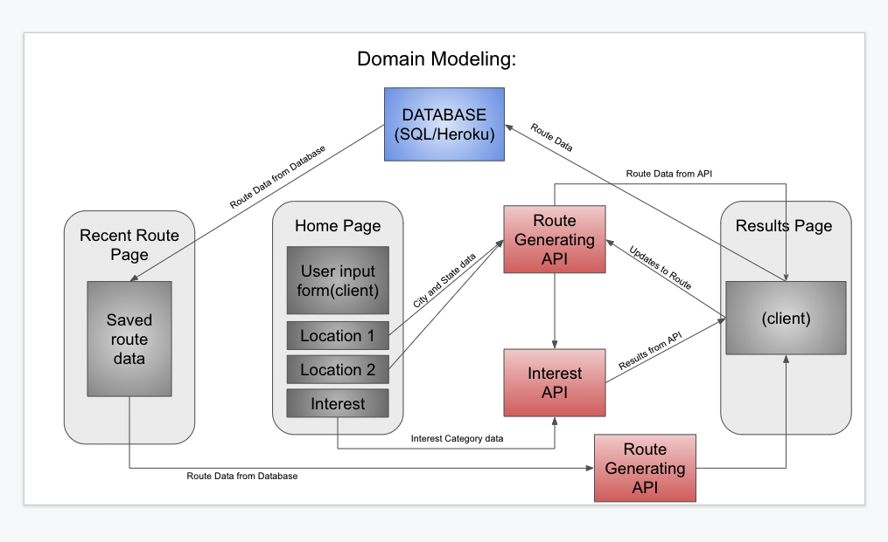
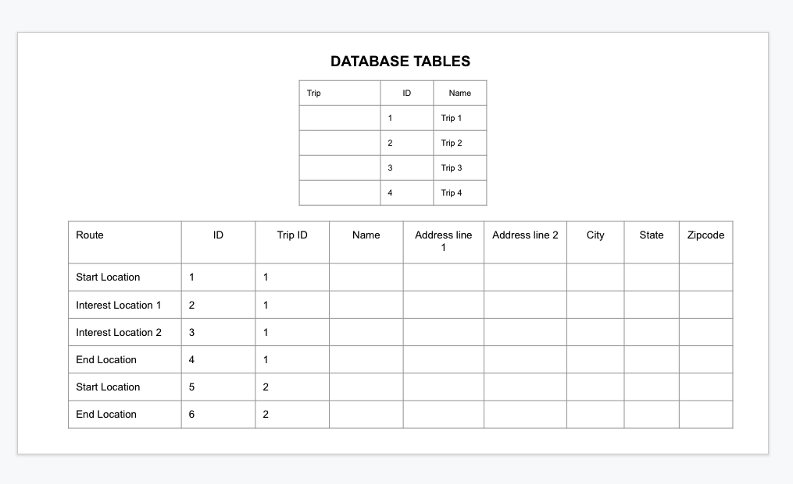

# 301FinalProject

## Wireframes

# The Road Trip Planner:

The MVP Dev Group's Road trip Planner allows users to find places to stop along the route.  The user will have the opportunity to chose a starting point and a destination then select places of interest from a dropdown menu.  The map will display the routes as well as any places of interest that are within a 10 mile radius of the route.  

## To Run the App:

To run the app, simply visit http://www.mvpdevgroupco.com/ where you will arrive at the home screen.  Enter the City and State corresponding to your departure and destinations then chose an interest from the drop down menu.  The user will then click the Submit button and be presented with the Google Maps directions and a list of businesses that match the search criteria from the drop-down menu.

## Tools Used:

The following tools were used to build and deploy this app:

- HTML
- CSS
- JavaScript
- Node.js
- jQuery
- Google Maps JavaScrip API
- Google Directions Service/Renderer
- Google Places Library
- Git and Github
- Heroku

## User Stories:

### **As a user, I want to find routes to my destination.**
  - I need an input field for the departure location and the destination.
  - I want to have a dropdown menu that displays my interests.
(Small Goal)

### **As a user, I want to have a map displayed to have a graphical depiction of my route.**  
  - Use an existing API to display graphical data.
  - Display a street view map.
  - Display a link textual directions.
  -	Display icons with points of interest on the map.
(Small Goal)

### **As a user, I want to be able to save routes to a database for personalization.**
  -	Store previous route information in SQL database.
  - A button for the user to save directions.
  -	Have a persistent database such as Heroku to readily serve users across the nation.
  -	Have previously saved routes to be displayed in the home page.
  -	I want to be able to update a previously saved route.
(Small Goal)

###	**As a user, I want to be able to search for interests.** 
  -	Present breweries and wineries along the route.**
  -	Present restaurants along the route.
  -	Present attractions along the route.  
  -	Present boutique hotels along the route.
  -	Present national parks and hiking trails along the route.
  -	Present comic bookstores or similar interests along the route.
(Extra Large Goal)

###	**As a user, I want to know more about the developers.**
  -	Create an about us page.
  -	Have a picture of each developer.
  -	Have a bio for each developer.
  -	Have a link to each developer’s social media site.
  -	Have a link to each developer’s portfolio.
(Medium Goal)

###	**As a user, I want to be able to easily navigate the entire website.**

  -	Add multiple links to different parts of the website for easy navigation.
  -	Have a consistent theme from page to page.
(Small to Medium Goal)

